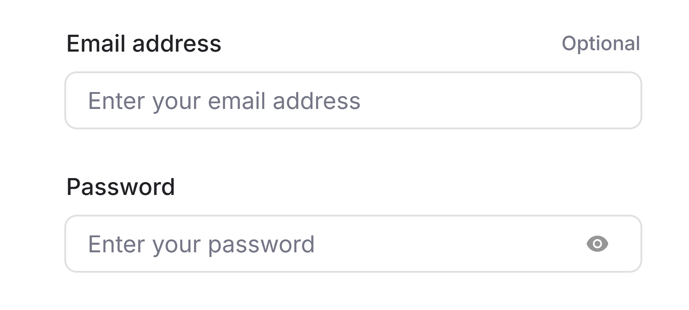
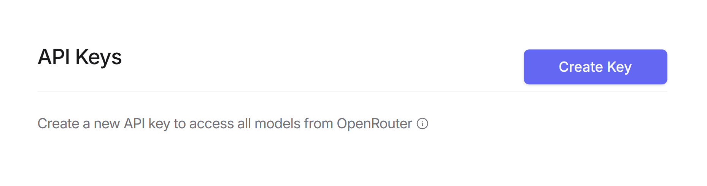
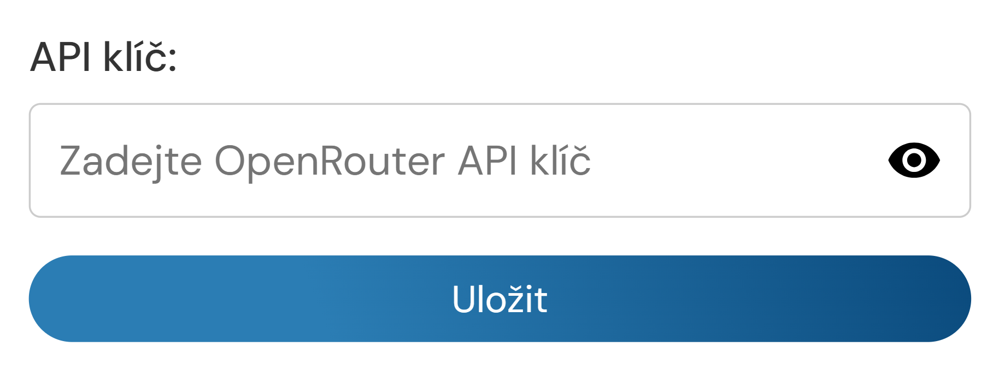

# HejChat

Tvůj roztomilý AI asistent &lt;3

## O projektu

HejChat je AI chatovací asistent školy Hejčín, který využívá pokročilé jazykové modely dostupné prostřednictvím OpenRouter API. Nabízí intuitivní a přívětivé rozhraní pro komunikaci s různými AI modely

## Funkce

- 💬 Plynulé streamování odpovědí po částech
- 📚 Pomoc s domácími úkoly a studijními otázkami
- 🔄 Přepínání mezi různými AI modely
- 💡 Nápady a inspirace pro školní projekty
- 🔑 Jednoduchá integrace s OpenRouter API

## API Nastavení

Pro používání HejChat potřebujete API klíč z OpenRouter:

### Krok 1: Registrace na OpenRouter
Nejprve přejděte na web <a href="https://openrouter.ai/sign-up" target="_blank" rel="noopener noreferrer">OpenRouter</a> a zaregistrujte se pro vytvoření účtu.

### Krok 2: Vytvoření API klíče
V nastavení vašeho OpenRouter účtu vytvořte nový <a href="https://openrouter.ai/settings/keys" target="_blank" rel="noopener noreferrer">API klíč</a>.

### Krok 3: Vložení API klíče do HejChat
Zkopírujte vytvořený API klíč a vložte jej do HejChat v sekci API.

## Dostupné modely

HejChat podporuje nejlepší bezplatné jazykové modely.

- Meta - Llama 3.3 70B
- Google - Gemini 2.5 Pro Experimental
- Mistral - Small 3.1 24B
- DeepSeek - V3 Base

## Jak používat

1. Vložte svůj OpenRouter API klíč v sekci API
2. Vyberte si preferovaný model v nastavení
3. Začněte konverzaci položením otázky
4. Užijte si plynulé chatování s AI!

## Podpora

Pokud vám HejChat pomáhá a chcete podpořit jeho další vývoj, můžete zvážit příspěvek v kryptoměnách:

- **Bitcoin**: `bc1qlmz8xxl5ewr4mv5nxqfqeyf2yl0mq74zpz649s`
- **Ethereum**: `0x12d94B6a5F6ce3988d16d408ac8661F648898afC`
- **Solana**: `Hbuz9fjY2FPZb2Cisd8Beyymc6m5b4TGRAZWJkFwnuJR`

Každý příspěvek nám pomáhá udržovat HejChat v provozu a přidávat nové funkce. Děkujeme za vaši podporu! ❤️